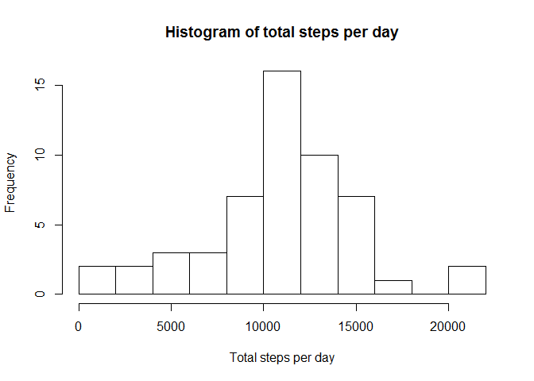
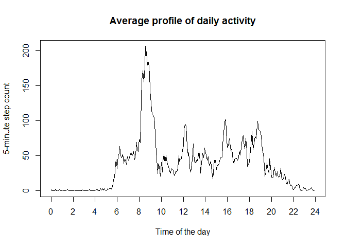
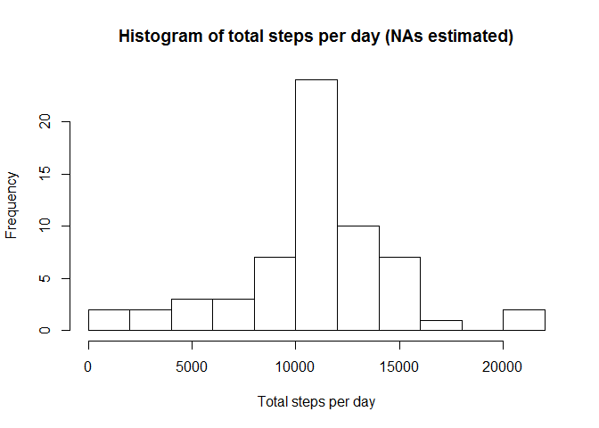
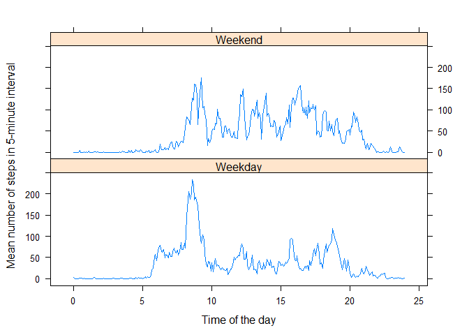

# Reproducible Research: Peer Assessment 1


## Loading and preprocessing the data

Unzip and read the raw data into R.


```r
stepData <- 
  read.csv(
    unzip('./activity.zip'),
    colClasses = c('numeric', 'POSIXct', 'numeric')
)
```

As the intervals are times in hours and minutes, change interval to decimal 
hours in order to make plots appear correct in time sequence.


```r
stepData$interval <- (stepData$interval%/%100)+(stepData$interval%%100/60)
```

## What is mean total number of steps taken per day?

Aggregate the raw data to get the steps per day, and plot a histogram of 
the results.


```r
aggDate <- aggregate(steps ~ date, stepData, sum)
hist(
  aggDate$steps,
  breaks = 10,
  main = 'Histogram of total steps per day', 
  xlab = 'Total steps per day'
)
```

 

Calculate and return the mean number of steps per day.


```r
meanSteps <- mean(aggDate$steps)
meanSteps
```

```
## [1] 10766.19
```

Calculate and return the median number of steps per day.


```r
medianSteps <- median(aggDate$steps)
medianSteps
```

```
## [1] 10765
```

## What is the average daily activity pattern?

Aggregate the raw data to get the steps by interval, and plot a line plot 
of the results.


```r
aggInterval <- aggregate(steps ~ interval, stepData, mean)
plot(
  aggInterval$interval,
  aggInterval$steps,
  type ='l',
  main = 'Average profile of daily activity', 
  xlab = 'Time of the day',
  ylab = '5-minute step count',
  xaxp = c(0,24,12)
)
```

 

Find which number period has the peak in mean activity.

```r
which.max(aggInterval$steps)
```

```
## [1] 104
```

Output the time corresponding to this period.

```r
hour <- aggInterval$interval[which.max(aggInterval$steps)]
paste0(hour%/%1, ':', hour%%1*60)
```

```
## [1] "8:35"
```


## Imputing missing values

Calculate and output the number of periods with NAs.

```r
sum(is.na(stepData$steps))
```

```
## [1] 2304
```

Create a new data fram with missing values replaced by the average for the
5-minute period across the whole period.

```r
replaceData <- stepData
replaceRefs <- match(stepData$interval, aggInterval$interval)
replaceData$steps[is.na(replaceData$steps)] <- aggInterval$steps[replaceRefs][is.na(replaceData$steps)]
```

Create a new histogram of the total number of steps per day using the data 
with NAs replaced.

```r
aggRepDate <- aggregate(steps ~ date, replaceData, sum)
hist(
  aggRepDate$steps,
  breaks = 10,
  main = 'Histogram of total steps per day (NAs estimated)', 
  xlab = 'Total steps per day'
)
```

 

Imputing missing values has added many more days which have the mean total
number of steps per day. This has reduced the variance of the data, and 
produced a histogram with a sharper peak.

## Are there differences in activity patterns between weekdays and weekends?

Add a column to the original data to indicate whether each day is a 
weekday or weekend. The original data (with NAs) has been used to avoid 
biasing the results toward the average activity pattern.

```r
library(lubridate)
stepData$wday <- wday(stepData$date)
stepData$state <- as.factor(NA)
levels(stepData$state) <- c('Weekday', 'Weekend')
stepData$state[stepData$wday == 1 | stepData$wday == 7] <- as.factor('Weekend')
stepData$state[stepData$wday > 1 & stepData$wday < 7] <- as.factor('Weekday')
```

Aggregate the dataset by interval & weekend/weekday.

```r
aggNew <- aggregate(steps ~ interval + state, stepData, mean)
```

Plots of activity patterns for weekdays and weekends are shown below. The 
original data (with NAs) has been used to avoid biasing the results toward 
the average activity pattern.

```r
library(lattice)
xyplot(
  steps ~ interval | state, 
  aggNew, 
  type ='l', 
  layout = c(1,2),
  xlab = 'Time of the day',
  ylab = 'Mean number of steps in 5-minute interval'
  )
```

 
